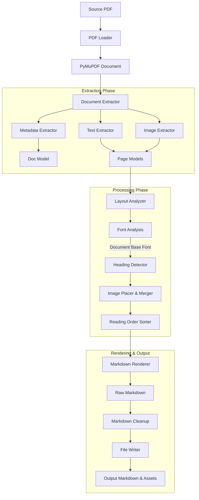

# PDF2MD

A CLI tool and Python library that converts PDF documents into Markdown while extracting embedded images into a local folder and automatically linking them inside the generated Markdown.

---

## Features

- **Progressive Extraction**: Uses `tqdm` progress bars for real-time monitoring of large documents.
- **Robust Heading Detection**: Computes a document-wide font distribution baseline to identify headings consistently.
- **Relative Path Resolution**: Automatically inserts correctly resolved relative image references into the Markdown output.
- **Reading Order Preservation**: Sorts page elements (text and images) from top-to-bottom and left-to-right.
- **Clean Markdown Output**: Collapses excessive blank lines and structures the markdown with clear page delimiters.
- **Multi-Platform Support**: Works on Linux, macOS, and Windows.

---

## Installation

### 1. Clone the Repository

```bash
git clone https://github.com/cyberaionics/PDF2MD.git
cd PDF2MD
```

### 2. Create a Virtual Environment (Recommended)

Linux/macOS:

```bash
python -m venv .venv
source .venv/bin/activate
```

Windows:

```powershell
python -m venv .venv
.venv\Scripts\activate
```

### 3. Install Dependencies

```bash
pip install -r requirements.txt
```

### 4. Install the Package in Editable Mode

```bash
pip install -e .
```

Verify installation:

```bash
pdf2md --help
```

---

## How to Use

### 1. Command Line Interface (CLI)

#### Basic Usage

Convert a PDF using the default image directory (`assets`):

```bash
pdf2md input.pdf output.md
```

#### Custom Image Directory

Save extracted images to a custom subfolder:

```bash
pdf2md input.pdf output.md --images-dir images
```

#### Output Structure

```text
project/
├── output.md
└── assets/  (or custom directory)
    ├── page_1_img_1.png
    ├── page_2_img_1.png
    └── ...
```

---

### 2. Python API

You can integrate `pdf2md` directly into your Python scripts or applications.

```python
from pdf2md import PDFToMarkdownConverter

# Initialize the converter
converter = PDFToMarkdownConverter(
    input_pdf="docs/sample.pdf",
    output_md="outputs/sample.md",
    image_dir="outputs/images"
)

# Convert the document
# This runs the extraction, layout analysis, rendering, and file writing steps.
markdown_content = converter.convert()
```

---

## Architecture Overview

PDF2MD operates as a pipeline consisting of five major phases:

1. **Loading Phase**: PyMuPDF (`fitz`) opens the PDF and initializes the internal representation.
2. **Extraction Phase**: Extract metadata, text blocks (with dimensions and font sizes), and image streams (saving them to disk).
3. **Processing Phase**:
   - **Font Analysis**: Computes a document-wide frequency map of font sizes to identify the most common font size (body-text font size).
   - **Heading Detection**: Classifies text blocks as headings (H1, H2, H3) based on their scale relative to the body-text font baseline, preventing page-by-page heading inconsistencies.
   - **Image Placement & Merger**: Combines text blocks and image blocks into page-specific layout items.
   - **Reading Order Sorting**: Sorts all layout items using their `(y0, x0)` coordinates (top-to-bottom, left-to-right).
4. **Rendering Phase**: Iterates over page layouts and renders Markdown blocks, translating absolute image paths to relative paths starting from the output Markdown file location.
5. **Cleanup Phase**: Post-processes the raw Markdown string to collapse multiple consecutive blank lines.

### Data Flow Diagram



---

## CLI Reference

### Full Syntax

```bash
pdf2md INPUT_PDF OUTPUT_MD [OPTIONS]
```

### Arguments

| Argument | Description |
|-----------|-------------|
| `INPUT_PDF` | Path to the source PDF file |
| `OUTPUT_MD` | Path to the generated Markdown file |

### Options

| Option | Description | Default |
|----------|-------------|----------|
| `--images-dir` | Folder for extracted images | `assets` |
| `--help` | Show this help message and exit | - |

---

## Project Structure

```text
pdf2md/
├── pdf2md/
│   ├── cli.py                     # Command Line Interface entry point
│   ├── converter.py               # Orchestrator of the translation pipeline
│   ├── extractors/
│   │   ├── __init__.py
│   │   ├── document_extractor.py  # Page-by-page extractor loop
│   │   ├── image_extractor.py     # Image binary stream extractor
│   │   ├── metadata_extractor.py  # PDF metadata parser
│   │   ├── pdf_loader.py          # PDF document loader helper
│   │   └── text_extractor.py      # Bounding-box text extractor
│   ├── models/
│   │   ├── __init__.py
│   │   ├── block.py               # Text block model
│   │   ├── document.py            # Document model representing whole PDF
│   │   ├── image.py               # Extracted image metadata model
│   │   ├── layout_item.py         # Unified text/image item wrapper
│   │   └── page.py                # Page structure container
│   ├── processors/
│   │   ├── __init__.py
│   │   ├── font_analysis.py       # Font size frequency analyzer
│   │   ├── heading_detector.py    # Font size relative classifier
│   │   ├── image_placer.py        # Text & image layouts compiler
│   │   ├── markdown_cleanup.py    # Blank line post-processing filter
│   │   └── reading_order.py       # Layout items sorting logic
│   ├── renderers/
│   │   ├── __init__.py
│   │   ├── caption_detector.py    # Figure caption helper
│   │   ├── image_helpers.py       # Image tag helpers
│   │   └── markdown_renderer.py   # Markdown output writer & layout compiler
│   └── utils/
│       ├── __init__.py
│       ├── file_utils.py          # Base path existence helper
│       ├── file_writer.py         # Parent folder checking & writer utility
│       ├── logger.py              # Application-wide logger configuration
│       └── path_utils.py          # Relative path calculator
│
├── tests/                         # Pytest test suite
├── requirements.txt               # Main runtime dependencies
├── pyproject.toml                 # Package setup and build tool settings
└── README.md                      # Comprehensive developer and user guide
```

---

## Running Tests

Run all tests:

```bash
pytest
```

Run a specific test:

```bash
pytest tests/test_renderer.py
```

---

## Troubleshooting

### `pdf2md: command not found`

If running `pdf2md` directly fails, make sure you installed the package in editable mode within your active virtual environment:

```bash
pip install -e .
```

You can verify where the executable points using:

```bash
which pdf2md      # Linux / macOS
where pdf2md      # Windows (Command Prompt)
```

### Images Not Appearing in Markdown

Ensure that the output markdown and the image directory are placed relative to one another in the exact structure they were built. If you move the markdown file, you must move the images folder accordingly, or update the relative links manually.

### PDF Produces Empty Markdown

Possible causes:
- **Scanned PDF**: The document consists of raw images rather than selectable text.
- **Corrupted Structure**: The PDF lacks accessible layout metadata.
- **Strict DRM / Encrypted PDF**: Text selection is disabled.

---

## License

MIT License